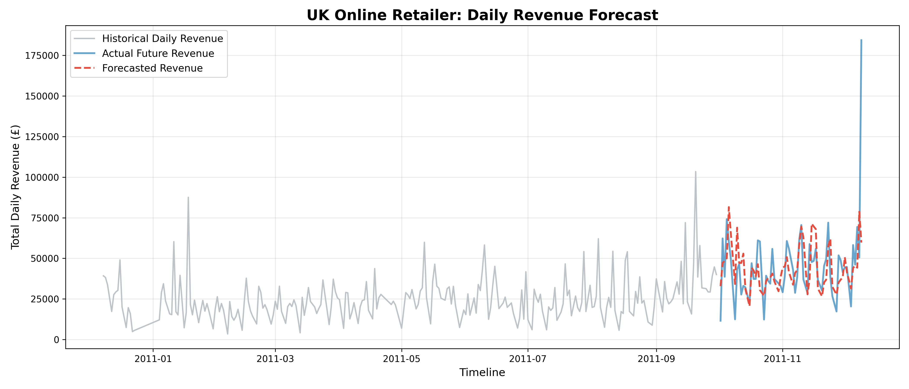

# FUTURE_ML_01

# E-Commerce Demand & Revenue Forecasting 📈

## 🔍 Project Overview
This project builds a Machine Learning pipeline to forecast daily e-commerce revenue using the UCI Online Retail dataset. By transforming raw, messy transaction logs into actionable business intelligence, this model helps retail managers anticipate demand spikes, optimize inventory purchasing, and manage cash flow.

## 🛠️ Tech Stack
* **Language:** Python
* **Data Processing & Engineering:** Pandas, NumPy
* **Machine Learning:** Scikit-learn (`RandomForestRegressor`)
* **Data Visualization:** Matplotlib

## ⚙️ The Data Pipeline
Real-world POS data is notoriously messy. The pipeline handles:
1. **Data Cleaning:** Filtering out canceled orders, bad debt adjustments, and missing entities.
2. **Feature Engineering:** Aggregating hundreds of thousands of line items into daily revenue, extracting seasonal features (day of week, month), and applying a 7-day rolling average to smooth market noise.
3. **Forecasting:** Training a Random Forest model on historical data to predict the final 20% of the timeline.

## 📊 Business Impact & Visualizations
The model successfully captures the volatile weekly seasonality of the e-commerce store. 

**How a business can use this:**
* **Supply Chain Optimization:** Order inventory for top-selling SKUs weeks in advance of predicted surges.
* **Infrastructure Scaling:** Proactively increase server capacity before forecasted high-traffic days to prevent downtime.
* **Cash Flow Management:** Adjust staffing and marketing spend during predicted slow periods.

## 🚀 How to Run the Project
1. Clone this repository.
2. Download the [UCI Online Retail Dataset](https://archive.ics.uci.edu/dataset/352/online+retail).
3. Run the Jupyter Notebook to execute the data cleaning and model training pipeline.
